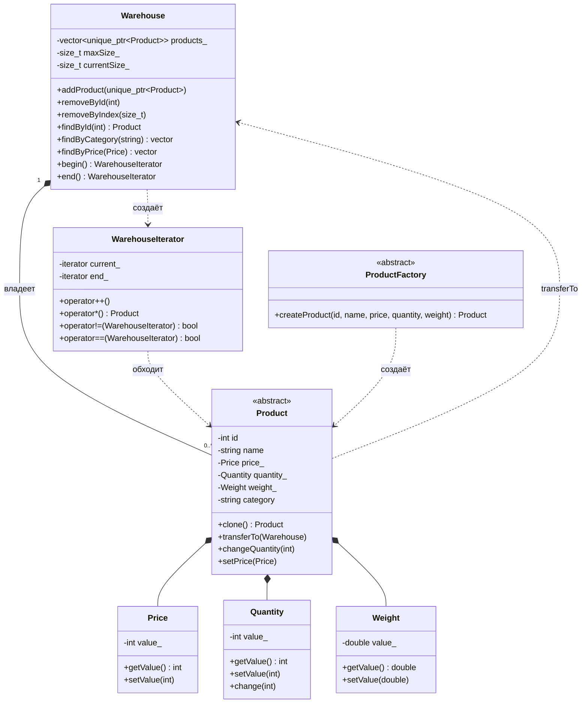
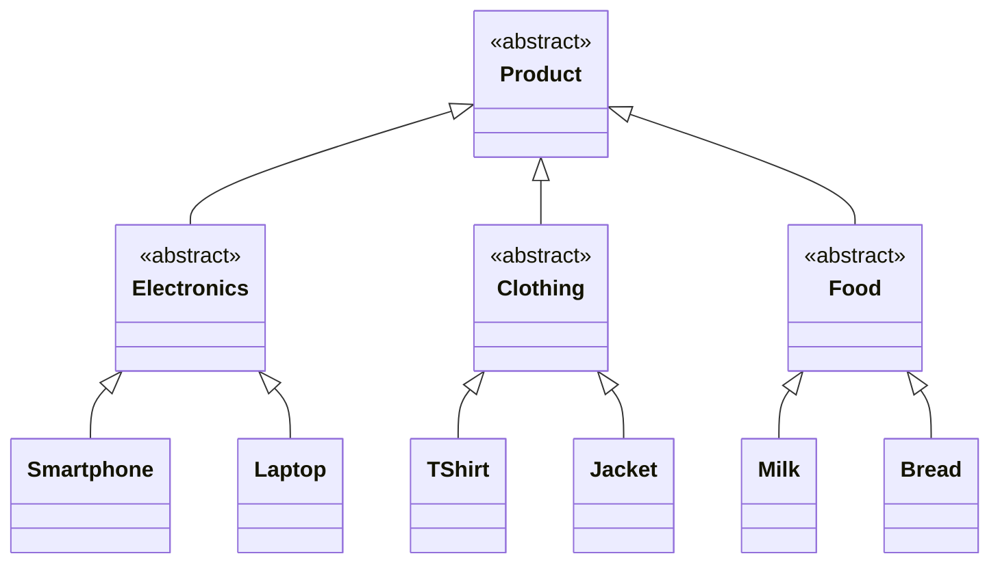
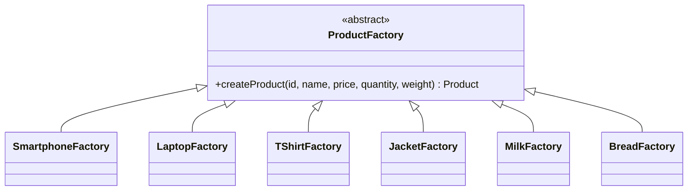

# Архитектура системы склада

## Основные связи

```mermaid
classDiagram
class Warehouse {
  -vector~unique_ptr~Product~~ products_
  -size_t maxSize_
  -size_t currentSize_
  +addProduct(unique_ptr~Product~)
  +removeById(int)
  +removeByIndex(size_t)
  +findById(int) Product
  +findByCategory(string) vector
  +findByPrice(Price) vector
  +begin() WarehouseIterator
  +end() WarehouseIterator
}
class WarehouseIterator {
  -iterator current_
  -iterator end_
  +operator++()
  +operator*() Product
  +operator!=(WarehouseIterator) bool
  +operator==(WarehouseIterator) bool
}
class Product {
  <<abstract>>
  -int id
  -string name
  -Price price_
  -Quantity quantity_
  -Weight weight_
  -string category
  +clone() Product
  +transferTo(Warehouse)
  +changeQuantity(int)
  +setPrice(Price)
}
class Price {
  -int value_
  +getValue() int
  +setValue(int)
}
class Quantity {
  -int value_
  +getValue() int
  +setValue(int)
  +change(int)
}
class Weight {
  -double value_
  +getValue() double
  +setValue(double)
}
class ProductFactory {
  <<abstract>>
  +createProduct(id, name, price, quantity, weight) Product
}
Warehouse "1" *-- "0..*" Product : владеет
Warehouse ..> WarehouseIterator : создаёт
WarehouseIterator ..> Product : обходит
Product *-- Price
Product *-- Quantity
Product *-- Weight
Product ..> Warehouse : transferTo
ProductFactory ..> Product : создаёт
```

## Иерархия товаров

```mermaid
classDiagram
class Product {
  <<abstract>>
}
class Electronics {
  <<abstract>>
}
class Clothing {
  <<abstract>>
}
class Food {
  <<abstract>>
}
Product <|-- Electronics
Product <|-- Clothing
Product <|-- Food
Electronics <|-- Smartphone
Electronics <|-- Laptop
Clothing <|-- TShirt
Clothing <|-- Jacket
Food <|-- Milk
Food <|-- Bread
```

## Иерархия фабрик

```mermaid
classDiagram
class ProductFactory {
  <<abstract>>
  +createProduct(id, name, price, quantity, weight) Product
}
ProductFactory <|-- SmartphoneFactory
ProductFactory <|-- LaptopFactory
ProductFactory <|-- TShirtFactory
ProductFactory <|-- JacketFactory
ProductFactory <|-- MilkFactory
ProductFactory <|-- BreadFactory
```
